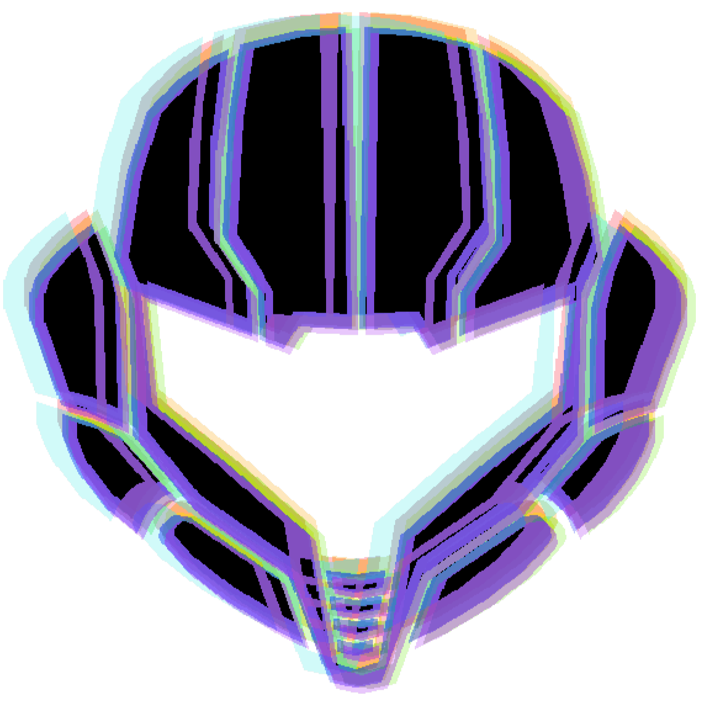

<h1 align="center">Hello, I'm Carlo Proserpio!  </h1>

🎓 **Master’s Student in Computer Engineering** at Università degli Studi Roma Tre.  
💻 Passionate about **software** and **hardware**, with a particular focus on **low-level programming**, **backend development**, and **software algorithms**. I'm always eager to experiment and expand my knowledge through new projects.

### 📚 **Education**
- **Master’s Degree in Computer Engineering (in progress)** – Università degli Studi Roma Tre  
- **Bachelor’s Degree in Computer Engineering** – Università degli Studi Roma Tre (110/110 cum laude)  
- **Italian High School Diploma** – Liceo Scientifico Stanislao Cannizzaro, Roma  
- **American High School Diploma** – Mater Academy High School, Miami  
- **Cambridge B2 English Certification**

 

  
    <h3><b>Programming Languages</b></h3>
      
    <h3><b>Frameworks & Tools</b></h3>
      
      

#

<h3>
  📫 Let's connect
</h3>
&nbsp;&nbsp;

